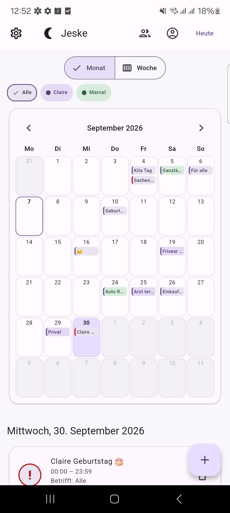
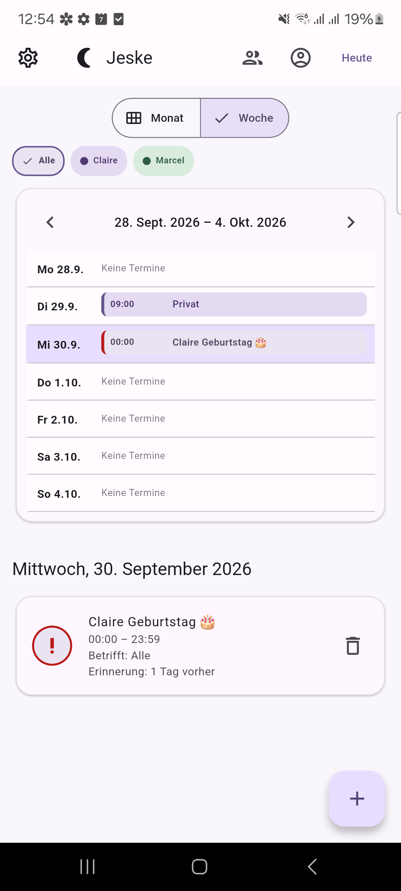
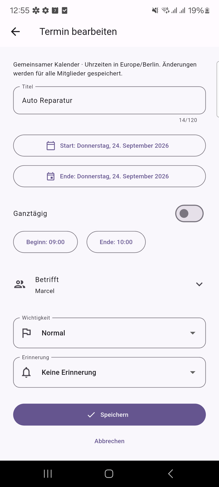
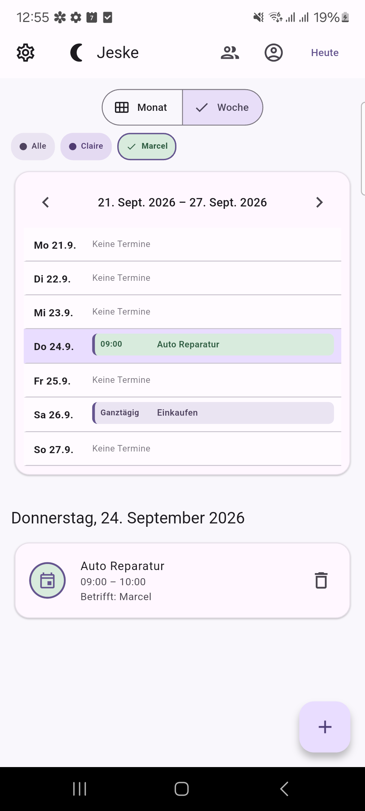
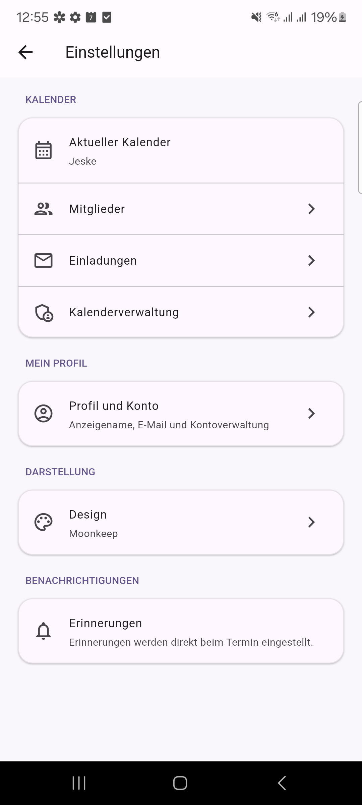
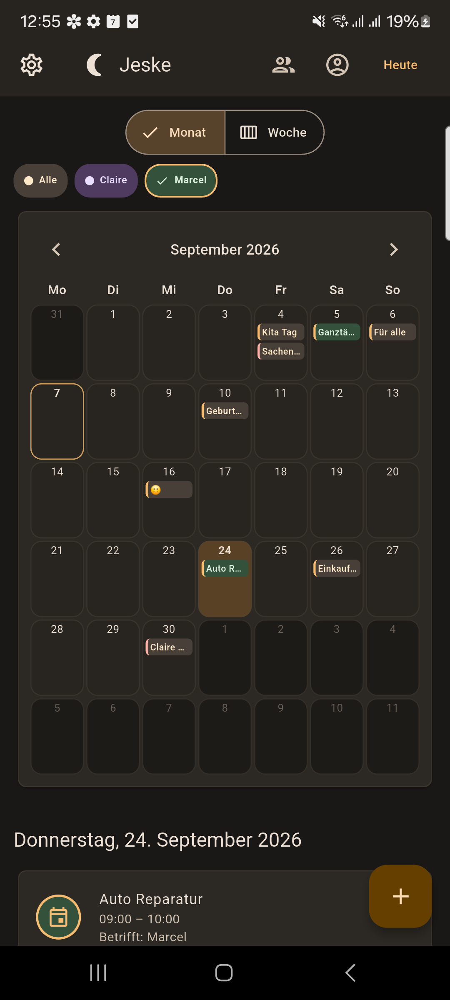

# Moonkeep

**A shared calendar for families and small private groups.**

Moonkeep is a Flutter app for coordinating everyday plans with a partner,
family, friends, or a shared household. It combines a focused calendar with
live synchronization, simple invitations, member-aware events, and local
reminders.

<p align="center">
  <strong>Flutter</strong> ·
  <strong>Firebase</strong> ·
  <strong>Android private beta</strong> ·
  <strong>iOS preparation started</strong> ·
  <strong>Paused / On Hold</strong>
</p>

## Project status

Moonkeep is currently paused after reaching private Android beta readiness.

Development is on hold because the primary second user moved from Android to
iOS while the available development environment is Windows-only. The iOS
project structure and part of the platform preparation already exist, but an
actual iOS build, signing, and device validation require macOS and Xcode.

The project is not discontinued. Development may continue when a suitable
macOS build environment becomes available.

## Screenshots

| Month view | Week view | Event editor |
| :---: | :---: | :---: |
|  |  |  |

| Member filter | Settings | Grimoire theme |
| :---: | :---: | :---: |
|  |  |  |

## Features

### Calendar

- Focused month and week views with daily details
- One-time, recurring, all-day, and multi-day events
- Daily, weekly, biweekly, monthly, and yearly recurrence
- Optional recurrence end dates and selectable local reminders
- Three priority levels

### Sharing

- Shared calendars with Firestore live synchronization
- One-time invitation codes
- Member assignments and member filters
- Display names and stable member colors
- Ownership transfer, leaving, and calendar dissolution

### Personalization and account

- Five persistent visual themes and a central settings hub
- Firebase email/password authentication and email verification
- Password reset, reauthentication, and account deletion

## Platform status

| Platform | Status |
| --- | --- |
| Android | Private beta ready; signed APK and AAB build successfully |
| iOS | Project and code preparation started; build, signing, and device test pending |
| Web | Development preview only; not a product target |
| Desktop | Not targeted |

## Android

The current Android version is **0.5.0+9**. Its main two-member workflows have
been exercised on real Android devices, and signed release APK and AAB artifacts
build successfully. No release binary is stored in this repository.

## iOS

The iOS Runner project uses the bundle identifier `dev.moonkeep.moonkeep` and
targets iOS 15. Firebase and local-notification integration are partially
prepared in the shared Flutter code.

iOS is **not yet validated or advertised as supported**. The Firebase iOS app
configuration, Apple signing, Xcode build, and testing on a real iPhone remain
to be completed on macOS.

## Technology

- Flutter and Dart
- Firebase Authentication
- Cloud Firestore with live listeners and security rules
- `flutter_local_notifications` with timezone-aware scheduling
- Android and an existing Flutter iOS Runner project

Moonkeep remains Spark-first: it does not require Cloud Functions, Blaze, or
another paid backend service. A recurring series remains one Firestore document;
visible occurrences and local reminders are calculated for bounded time ranges.

## Architecture notes

- Firestore uses `families` internally; product language uses calendars and
  members.
- Shared data requires a signed-in user with a verified email address.
- Critical membership, invitation, ownership, and dissolution transitions use
  Firestore transactions and restrictive rules.
- Existing records without newer event fields remain backward compatible.
- Firebase build configuration and signing keys are local and intentionally not
  committed.
- Shared calendar data uses confirmed Firestore server state rather than a local
  Firestore cache.

More detail is available in the [MVP definition](docs/MVP.md),
[project status](PROJECT_STATUS.md), [Firebase setup](docs/FIREBASE_SETUP.md),
and [Firestore setup](docs/FIRESTORE_SETUP.md).

## Local development

The repository's existing Windows setup uses a local Flutter SDK under
`.tools/flutter`; that SDK is ignored by Git. Other environments can install
Flutter using the [official installation guide](https://docs.flutter.dev/install/manual).

The locked toolchain is Flutter 3.47.2 / Dart 3.13.2. Dependencies are pinned by
`pubspec.lock`.

```powershell
.\.tools\flutter\bin\flutter.bat pub get
.\.tools\flutter\bin\flutter.bat analyze --no-pub
.\.tools\flutter\bin\flutter.bat test --no-pub
```

Android development additionally requires Android SDK Platform 36. iOS builds
require macOS, Xcode, and the appropriate Apple signing configuration.

## Current development status

Moonkeep is on hold after reaching Android private beta readiness. The next
major milestone is validating the prepared iOS path with macOS, Xcode, and a
real iPhone. Feature development is paused until that environment is available.

Moonkeep is currently a personal, small-group beta project. No public release
schedule is promised.
